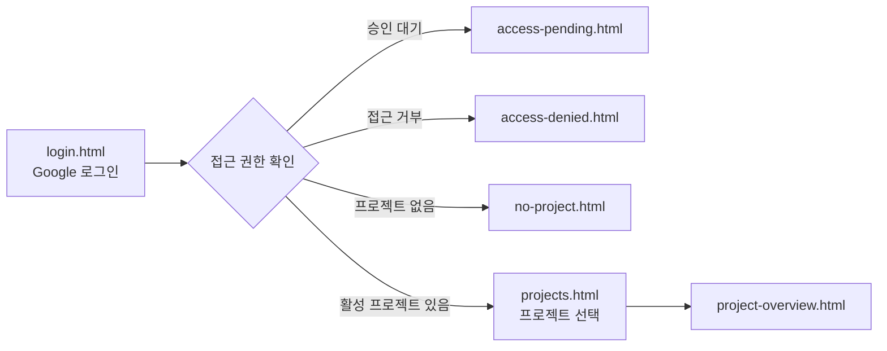

# STAM PR #320 — Auth Entry Flow Beta Polish & Internal Copy Removal

## 목표

1차 베타 진입 흐름(로그인 → 프로젝트 선택 → Project Overview)의 사용자 문구를 정리하고, Firebase/Firestore 등 내부 구현 용어를 화면에서 제거한다.

## 베타 범위

| 항목 | 결정 |
|------|------|
| 로그인 | Google 로그인만 |
| 회원가입 | 이메일·비밀번호 미제공 |
| 초대/멤버 관리 | 이번 PR 범위 외 |
| 데이터 접근 | Firestore read-only (기존 유지) |
| Firestore write | 없음 |

## 진입 흐름



## 문구 변경 요약

| Before | After |
|--------|-------|
| Firebase Auth를 사용할 수 없습니다. | 로그인 기능을 불러오지 못했습니다. 잠시 후 다시 시도해 주세요. |
| Firebase SDK 초기화 대기 중… | 로그인 준비 중입니다. 잠시 후 다시 시도해 주세요. |
| 접근 가능한 active 프로젝트… | 접근 가능한 프로젝트가 없습니다. 초대 상태를 확인해 주세요. |
| active 프로젝트만 표시 | 접근 권한이 활성화된 프로젝트만 표시 |
| 멤버 상태를 active로 전환 | 접근 권한을 승인 |

## 관리자 문의 버튼

`data-stam-auth-action="contact-admin"` 클릭 시 `showAuthMessage()`로 카드 하단 안내:

> 프로젝트 관리자에게 사용 중인 Google 계정으로 접근 권한을 요청해 주세요.

## 수정 파일

- `stam/pages/auth/*.html` (5)
- `stam/js/stam.auth-bootstrap.js`
- `stam/js/stam.auth-project-list.js`
- `stam/css/stam.auth.css`
- `scripts/test-auth-entry-flow-contract.mjs`
- `docs/reports/STAM_PR320_Auth_Entry_Flow_Beta_Polish.md`

## 미변경

- `stam.auth-membership-gate.js`
- Firestore rules / Firebase config
- 로그인 provider / popup 방식

## 검증

```bash
node scripts/test-auth-entry-flow-contract.mjs
node scripts/test-nav-live-dimmed-contract.mjs
node scripts/test-requirements-empty-state-contract.mjs
node scripts/test-requirements-firestore-list-contract.mjs
node scripts/test-requirements-service-contract.mjs
node scripts/test-requirements-no-inline-style.mjs
```
