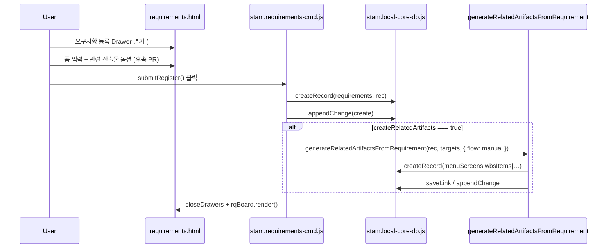
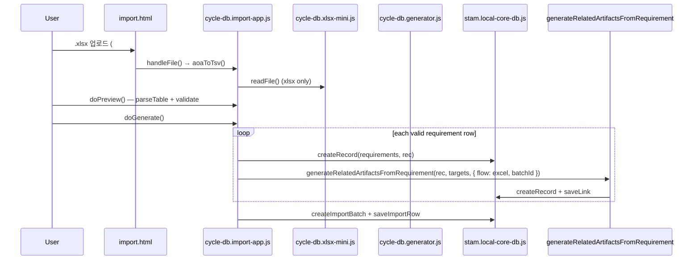

# STAM Requirement Creation & Related Artifacts Flow — PR #277

## 1. 목적

요구사항 생성 방식(직접 등록 · 엑셀 일괄 등록)과 **「관련 산출물 초안 함께 만들기」** 공통 옵션을 통합 설계합니다.

현재는 엑셀 가져오기(프로토타입 import) 경로에서만 6개 게시판 초안이 일괄 생성되고, 직접 등록 경로는 PR #261 이후 메뉴/화면목록만 암묵적으로 자동 생성됩니다. 두 경로의 UX·로직이 분리되어 사용자 혼란이 생길 수 있으므로, 동일한 정책·옵션·후처리 함수를 공유하는 구조로 재정의합니다.

**본 PR 범위:** 설계 문서 + 소스 인벤토리 + 후속 구현 PR 분리안. 제품 HTML/CSS/JS 구현 없음.

| 항목 | 값 |
|------|-----|
| 기준 main SHA | `6e66ac844a9202ea64369e12261b97e96af68f9a` |
| 조사 일시 (UTC) | 2026-06-29 |
| 조사 방식 | repo 실제 파일 grep · Read (추정 경로 미기록) |

---

## 2. 현재 문제

### 2.1 UX 불일치

| 경로 | 관련 산출물 생성 | 사용자 선택 |
|------|------------------|-------------|
| 직접 등록 (`requirements.html` Drawer) | PR #261 이후 **메뉴/화면목록만** 항상 자동 생성 | 옵션 UI 없음 |
| 엑셀 일괄 등록 (`cycle-db/import.html`) | **6개 게시판** 고정 일괄 생성 (기능정의·테스트 시나리오 포함) | 옵션 UI 없음 |

사용자 입장에서는 “엑셀로 올린 요구사항만 관련 산출물이 생긴다”고 인식하기 쉽고, 직접 등록과 정책이 다릅니다.

### 2.2 로직 분리

- 직접 등록: `stam.requirements-crud.js` 내부 `ensureMenuScreenDraftFromRequirement()` (인라인, 메뉴/화면만)
- 엑셀 일괄: `cycle-db.generator.js` `generate()` (순수 함수, 6종 고정 생성) → `cycle-db.import-app.js` `doGenerate()` 가 저장

공통 `generateRelatedArtifactsFromRequirement()` 계층이 없습니다.

### 2.3 메타데이터 불일치

- 직접 등록 메뉴 초안: `importBatchId: 'REQ-MANUAL'`, `sourceType: 'Requirement Import'` (manual 등록임에도 Import 라벨)
- 엑셀 생성물: `importBatchId` = 배치 ID, `sourceType: 'Requirement Import'`

통합 설계에서 제안하는 `generatedByFlow`, `autoGenerated`, `generationBatchId` 등은 아직 어느 경로에도 없습니다.

---

## 3. 제외 범위: 가져오기

이번 1차 적용 범위는 **요구사항 직접 등록**과 **엑셀 일괄 등록**만 다룹니다.

### 후속 범위로 보류 (가져오기)

| 유형 | 보류 사유 |
|------|-----------|
| 다른 프로젝트에서 가져오기 | 원본 선택 · 권한 · 이력 정책 필요 |
| 템플릿에서 가져오기 | 템플릿 버전 · 필드 매핑 정책 필요 |
| 외부 시스템 / Jira / Notion / API | 연동 계약 · 중복 · 병합 정책 필요 |
| 이전 버전 요구사항 가져오기 | 버전 diff · 연결 산출물 포함 여부 결정 필요 |

가져오기는 원본 선택, 중복 처리, 병합/복사 정책, 권한/이력/연결 산출물 포함 여부까지 결정해야 하므로 **이번 PR 및 1차 구현 범위에 넣지 않습니다.**

> 참고: 프로토타입 `cycle-db/import.html` UI 문구는 현재 “요구사항 가져오기”로 표기되어 있으나, 본 설계에서 정의하는 **「엑셀 일괄 등록」**과 기능적으로 대응합니다. 제품 통합 시 명칭 정리는 후속 PR에서 진행합니다.

---

## 4. 요구사항 생성 방식 정의

| # | 방식 | 현재 진입점 | 저장소 |
|---|------|-------------|--------|
| 1 | **직접 등록** | `stam/pages/boards/requirements.html` → 등록 Drawer `#rq-dw-register` | Local Core DB v2 `requirements` store |
| 2 | **엑셀 일괄 등록** | `stam/pages/prototype/cycle-db/import.html` → 엑셀 업로드 + 생성 버튼 | 동일 v2 store (게시판별) |

**제외:** 가져오기 계열(§3).  
**참고:** 제품 요구사항 게시판(`boards/requirements.html`)에는 현재 엑셀 UI가 없고, 엑셀 일괄 등록은 프로토타입 import 화면에만 존재합니다.

---

## 5. 공통 옵션 UX

직접 등록 Drawer와 엑셀 일괄 등록 화면 **모두** 아래 옵션을 제공합니다.

### 마스터 체크박스

```
☑ 관련 산출물 초안 함께 만들기
```

체크 시 생성 대상 선택 영역이 노출됩니다.

### 생성 대상 (하위 체크박스)

```
생성할 산출물
☑ 메뉴/화면목록
☑ WBS
□ 화면설계서
□ 기능정의서
```

- 마스터 OFF → 하위 영역 비활성(숨김 또는 disabled)
- 마스터 ON → 하위 기본값 적용(§6)
- 엑셀 일괄 등록: **일괄 등록되는 요구사항마다** 선택된 산출물 초안 생성

### 사용자 안내 (중복 시)

> 이미 생성된 관련 산출물이 있어 누락된 항목만 추가했습니다.

---

## 6. 기본값

| 생성 대상 | 기본값 | 사유 |
|-----------|--------|------|
| 메뉴/화면목록 | **ON** | 요구사항에서 바로 화면 후보로 연결 |
| WBS | **ON** | 요구사항 기반 작업 분해에 필요 |
| 화면설계서 | **OFF** | 템플릿 선택이 필요할 수 있음 |
| 기능정의서 | **OFF** | 메뉴/화면/WBS 정리 이후가 자연스러움 |

**테스트 시나리오**는 현재 엑셀 generator가 자동 생성하지만, 본 통합 옵션 4종에는 포함하지 않습니다(별도 후속 검토).

---

## 7. 생성 대상별 정책

| 대상 | store | 현재 직접 등록 | 현재 엑셀 일괄 | 통합 후 |
|------|-------|----------------|----------------|---------|
| 메뉴/화면목록 | `menuScreens` | PR #261 `ensureMenuScreenDraftFromRequirement` 항상 실행 | generator `reqId-SCR` 1건 | 옵션 ON 시 공통 함수 |
| WBS | `wbsItems` | 없음 (WBS 게시판 수동 등록만) | generator `reqId-WBS1~3` (분석·설계·검증) | 옵션 ON 시 공통 함수 |
| 화면설계서 | `screenSpecifications` | 없음 (화면설계 CRUD 수동만) | generator `reqId-SSP` 1건 | 옵션 ON 시 공통 함수 |
| 기능정의서 | `functionalDefinitions` | 없음 (기능정의 CRUD 수동만) | generator `reqId-FUN` 1건 | 옵션 ON 시 공통 함수 |

### 생성 상태

- `status: draft`
- `reviewStatus: Review Needed` (또는 게시판별 동등 한글 매핑)
- 요구사항과 `requirementId` / `artifactLinks` 로 연결

### WBS 세부

엑셀 generator 기준 3건(분석·설계·검증) 패턴을 초기 기본으로 유지하되, 공통 함수로 이전하여 직접 등록에서도 동일 개수·명명 규칙을 사용합니다.

### 화면설계서 세부

`stam.screen-specification-crud.js` 에 `templateId` 필드가 있으나, 자동 생성 시 템플릿 미지정 초안으로 생성하고 후속 수정에서 템플릿 선택 — 기본 OFF 정책과 정합.

---

## 8. 중복 방지 정책

같은 요구사항에서 **이미 관련 산출물이 연결·생성**되어 있으면 중복 생성하지 않습니다.

### 1차 기준: 누락된 항목만 생성

**판정 기준 (store + requirementId 연결):**

| 대상 | 존재 판정 |
|------|-----------|
| 메뉴/화면목록 | `menuScreens` 에 `requirementId === req.id` (또는 `sourceRef === req.id`) |
| WBS | `wbsItems` 에 `requirementId === req.id` |
| 화면설계서 | `screenSpecifications` 에 `requirementId === req.id` |
| 기능정의서 | `functionalDefinitions` 에 `requirementId === req.id` |

**예시:**

- REQ-001에 이미 메뉴/화면목록 연결됨
- 사용자가 메뉴/화면목록 + WBS 생성 요청
- → 메뉴/화면목록 스킵, **WBS만 생성**

### 현재 코드와의 차이

`ensureMenuScreenDraftFromRequirement()` (requirements-crud.js L44–97)는 메뉴/화면만 중복 체크하며, WBS·화면설계·기능정의는 검사하지 않습니다.

---

## 9. 생성 메타데이터

자동 생성된 관련 산출물에 부여할 최소 메타데이터:

| 필드 | 설명 | 예시 |
|------|------|------|
| `sourceRequirementId` | 원본 요구사항 record id | `REQ-MANUAL-20260629-120000` |
| `sourceRequirementNo` | 표시용 요구사항 번호 | 동일 또는 `requirementId` |
| `sourceRequirementTitle` | 원본 제목 스냅샷 | `로그인 2차 인증` |
| `generatedFrom` | 생성 원천 유형 | `requirement` |
| `generatedByFlow` | 생성 흐름 | `manual` \| `excel` |
| `autoGenerated` | 자동 생성 여부 | `true` |
| `generationBatchId` | 일괄 생성 배치 (엑셀: importBatchId, 단건: UUID 또는 `REQ-MANUAL-…`) | `imp_1719662400000` |
| `createdAt` | ISO 타임스탬프 | `db.createRecord` 기본값 활용 |
| `createdBy` | 행위자 | `prototype-user` (현행) |
| `status` | 초안 | `draft` |

후속 서버 저장 전환 시 Local IndexedDB 단계에서도 **동일 필드명**으로 관리합니다.

기존 `importBatchId` / `importRowId` / `sourceType` / `sourceRef` 는 하위 호환을 위해 유지하되, `generatedByFlow` 로 manual/excel 을 명시적으로 구분합니다.

---

## 10. 직접 등록 흐름



### 현재 구현 (조사 결과)

| 단계 | 파일 | 함수/요소 |
|------|------|-----------|
| Drawer HTML | `stam/pages/boards/requirements.html` | `#rq-dw-register` (L355), `#rq-reg-btn` (L64) |
| 등록 리셋 | `stam/js/stam.requirements-crud.js` | `resetRegister()` (L403) |
| 등록 저장 | `stam/js/stam.requirements-crud.js` | `submitRegister()` (L411) |
| 요구사항 insert | `stam/js/stam.requirements-crud.js` | `db.createRecord(STORE, rec)` (L442), `STORE='requirements'` |
| 메뉴 초안 (현행) | `stam/js/stam.requirements-crud.js` | `ensureMenuScreenDraftFromRequirement(rec)` (L450) — **항상 호출** |
| 목록 갱신 | `stam/js/stam.requirements-cycle.js` | `window.STAM.rqBoard.render()` |

### 통합 후 변경 방향

1. Drawer에 §5 옵션 UI 추가 (PR #278)
2. `submitRegister()` 에서 옵션 읽기 → `createRequirement` 래퍼 또는 인라인 후처리
3. `ensureMenuScreenDraftFromRequirement` 를 공통 함수로 흡수·대체

---

## 11. 엑셀 일괄 등록 흐름



### 현재 구현 (조사 결과)

| 단계 | 파일 | 함수/요소 |
|------|------|-----------|
| 화면 | `stam/pages/prototype/cycle-db/import.html` | 엑셀 업로드 `#imp-file` (L78), `#btn-generate` (L99) |
| 앱 로직 | `stam/js/prototype/cycle-db.import-app.js` | `handleFile()` (L277), `doPreview()` (L45), `doGenerate()` (L88) |
| 엑셀 파서 | `stam/js/prototype/cycle-db.xlsx-mini.js` | `readFile()` — `window.STAM_CYCLE.xlsx` |
| TSV 파싱 | `stam/js/prototype/cycle-db.generator.js` | `parseTable()` (L24), `validate()` (L40) |
| 6게시판 생성 | `stam/js/prototype/cycle-db.generator.js` | `generate(rows, projectId, batchId)` (L109) |
| 저장 | `stam/js/prototype/cycle-db.import-app.js` | `db.createRecord`, `createImportBatch`, `saveImportRow`, `saveLink` (L161–169) |

### 통합 후 변경 방향

1. import 화면에 §5 옵션 UI (PR #279)
2. `doGenerate()` 가 `generate()` 의 고정 6종 대신 **요구사항 record 생성 + 공통 후처리** 로 분리
3. 테스트 시나리오 자동 생성은 옵션 4종에 없으므로 generator 에서 제외 또는 별도 플래그

---

## 12. 공통 함수 설계안

### 권장 API

```javascript
/**
 * @param {object} input — 요구사항 필드 (title, description, …)
 * @param {object} options
 * @param {boolean} options.createRelatedArtifacts
 * @param {object} options.targets — { menuScreen, wbs, screenSpecification, functionalDefinition }
 * @param {'manual'|'excel'} options.generatedByFlow
 * @param {string} [options.generationBatchId]
 */
function createRequirement(input, options) {
  // 1. requirement 생성 (db.createRecord)
  // 2. if (options.createRelatedArtifacts)
  //      generateRelatedArtifactsFromRequirement(requirement, options)
  // 3. return { requirement, created: [...], skipped: [...] }
}

/**
 * @returns {{ created: ArtifactRef[], skipped: ArtifactRef[], message?: string }}
 */
function generateRelatedArtifactsFromRequirement(requirement, options) {
  // options.targets 기준으로 대상별 생성
  // 중복 방지: 누락된 항목만 생성 (§8)
  // 메타데이터 §9 부여
  // artifactLinks + artifactChanges 기록
}
```

### 권장 파일 배치 (후속 PR #280)

| 후보 | 장점 |
|------|------|
| **신규** `stam/js/stam.requirement-artifacts.js` | requirements-crud · import-app 양쪽에서 import, generator 순수 로직 이전 |
| `stam/js/stam.requirements-crud.js` 내 추출 | 변경 범위 작음, import 쪽 의존 증가 |

**권고:** `stam/js/stam.requirement-artifacts.js` 신설 + `cycle-db.generator.js` 의 행 단위 생성 로직을 단계적으로 이전.

### batchCreateRequirements

엑셀 경로:

```javascript
function batchCreateRequirements(rows, options) {
  var batchId = options.generationBatchId || batchId();
  return rows.reduce(function (chain, row) {
    return chain.then(function () {
      return createRequirement(rowToRequirementInput(row), Object.assign({}, options, {
        generatedByFlow: 'excel',
        generationBatchId: batchId
      }));
    });
  }, Promise.resolve());
}
```

---

## 13. 현재 소스 인벤토리

> 아래 경로는 **repo 실제 존재 확인 완료**. 추정 경로 없음.

### 13.1 요구사항 직접 등록 Drawer

| 구분 | 경로 | 식별자 |
|------|------|--------|
| HTML | `stam/pages/boards/requirements.html` | `#rq-dw-register`, `#rq-reg-btn`, `#rq-scrim` |
| CRUD | `stam/js/stam.requirements-crud.js` | `regDrawer`, `resetRegister`, `submitRegister` |
| 목록 | `stam/js/stam.requirements-cycle.js` | `window.STAM.rqBoard`, `PID='proto-proj-001'` |
| 셸 | `stam/js/stam.requirements.js` | 페이지 셸/드로워 open (scrim) |

### 13.2 요구사항 저장

| 구분 | 경로 | 식별자 |
|------|------|--------|
| insert | `stam/js/stam.requirements-crud.js` | `db.createRecord('requirements', rec)` in `submitRegister` |
| DB 어댑터 | `stam/js/stam.local-core-db.js` | `createRecord`, `updateRecord`, `appendChange` |
| 스키마 | `stam/js/stam.core-db-schema.js` | `STORES.requirements`, `DB_NAME='stam-core-local-db-v1'` |

### 13.3 엑셀 일괄 등록 화면

| 구분 | 경로 | 식별자 |
|------|------|--------|
| HTML | `stam/pages/prototype/cycle-db/import.html` | `#imp-file`, `#imp-input`, `#btn-preview`, `#btn-generate` |
| 앱 | `stam/js/prototype/cycle-db.import-app.js` | `doPreview`, `doGenerate`, `handleFile`, `aoaToTsv` |
| 엑셀 | `stam/js/prototype/cycle-db.xlsx-mini.js` | `STAM_CYCLE.xlsx.readFile` |

### 13.4 엑셀 파싱 → 요구사항 생성

| 구분 | 경로 | 식별자 |
|------|------|--------|
| 파싱/검증 | `stam/js/prototype/cycle-db.generator.js` | `parseTable`, `validate`, `sampleTsv` |
| 생성 | `stam/js/prototype/cycle-db.generator.js` | `generate(rows, projectId, batchId)` |
| 오케스트레이션 | `stam/js/prototype/cycle-db.import-app.js` | `doGenerate` → `gen.generate` → `db.createRecord` loop |

### 13.5 관련 산출물 자동 생성 (현행)

| 경로 | 범위 | 비고 |
|------|------|------|
| `stam/js/stam.requirements-crud.js` | `ensureMenuScreenDraftFromRequirement` | 직접 등록 후 **메뉴/화면만**, 옵션 없이 항상 |
| `stam/js/prototype/cycle-db.generator.js` | `generate()` | 요구사항당 기능정의·메뉴/화면·WBS×3·화면설계·테스트×2 + links |

### 13.6 저장소 (localStorage / IndexedDB)

| 저장소 | 경로 | 용도 |
|--------|------|------|
| **IndexedDB v2** | `stam/js/stam.local-core-db.js` + `stam.core-db-schema.js` | 제품 6게시판 + importBatches/importRows/artifactLinks/artifactChanges |
| IndexedDB v1 (프로토타입) | `stam/js/prototype/cycle-db.repo.local.js` | `stam-prototype-cycle-db` — 일부 보드 HTML이 script include 하지만 import 흐름은 **v2** 사용 |
| localStorage | `stam/js/stam.theme.js` | 테마만 (`stam.theme`) — 요구사항 데이터 없음 |

### 13.7 메뉴/화면목록 생성

| 경로 | 함수 | 트리거 |
|------|------|--------|
| `stam/js/stam.requirements-crud.js` | `ensureMenuScreenDraftFromRequirement` | 직접 등록 성공 후 |
| `stam/js/stam.menu-screen-crud.js` | `createRecord('menuScreens', …)` | 메뉴/화면 게시판 수동 등록 |
| `stam/js/prototype/cycle-db.generator.js` | menuScreen artifact `reqId-SCR` | 엑셀 일괄 |

### 13.8 WBS 생성

| 경로 | 함수 | 트리거 |
|------|------|--------|
| `stam/js/stam.wbs-crud.js` | `submitCreate` → `db.createRecord('wbsItems')` | WBS 게시판 수동 |
| `stam/js/prototype/cycle-db.generator.js` | wbs artifacts `reqId-WBS1~3` | 엑셀 일괄만 |

### 13.9 화면설계서 / 기능정의서 생성 가능 여부

| 대상 | 수동 CRUD | 요구사항 연동 자동 생성 |
|------|-----------|-------------------------|
| 화면설계서 | `stam/js/stam.screen-specification-crud.js` — `db.createRecord('screenSpecifications')` | 엑셀 generator만 (`reqId-SSP`). 직접 등록 경로 **없음** |
| 기능정의서 | `stam/js/stam.functional-definition-crud.js` — `submitRegister` → `createRecord('functionalDefinitions')` | 엑셀 generator만 (`reqId-FUN`). 직접 등록 경로 **없음** |

화면설계서 고급 UI(`stam/js/stam.screen-specification.js`)는 mock only 주석 — 자동 생성 초안은 v2 CRUD store 경로를 사용.

### 13.10 링크 저장

| 경로 | 함수 |
|------|------|
| `stam/js/stam.local-core-db.js` | `saveLink` |
| `stam/js/stam.core-db-schema.js` | `LINK_TYPE.*` (requirementToFunction, screenToWbs, …) |

---

## 14. 구현 PR 분리안

| PR | 제목 | 범위 | 선행 |
|----|------|------|------|
| **#278** | 요구사항 직접 등록 Drawer에 관련 산출물 초안 생성 옵션 UI 추가 | `requirements.html`, `stam.requirements-crud.js` (옵션 읽기만, 로직은 #280 연동) | #280 권장 선행 또는 동시 |
| **#279** | 엑셀 일괄 등록 화면에 동일 옵션 추가 | `import.html`, `cycle-db.import-app.js` | #280 |
| **#280** | 공통 `generateRelatedArtifactsFromRequirement()` 로직 분리 | 신규 `stam.requirement-artifacts.js`, generator 리팩터 | — **최우선** |
| **#281** | 중복 방지 / 누락 항목만 생성 정책 적용 | 공통 함수 + 사용자 메시지 | #280 |
| **#282** | QA 및 audit log closeout | Playwright QA, `pr-audit-log.jsonl` | #278–#281 |

### 권장 실제 구현 순서 (인벤토리 기반 조정)

1. **PR #280** — 공통 함수·메타데이터·링크 생성 (로직 SSOT)
2. **PR #281** — 중복 방지 (공통 함수에 통합 가능 시 #280과 병합 검토)
3. **PR #278** — 직접 등록 UI + `ensureMenuScreenDraftFromRequirement` 제거/대체
4. **PR #279** — 엑셀 UI + `generate()` 고정 6종 → 선택적 targets
5. **PR #282** — QA closeout

---

## 15. QA 기준

### 기능

- [ ] 직접 등록: 마스터 OFF → 요구사항만 생성, 관련 산출물 없음
- [ ] 직접 등록: 마스터 ON + 기본 targets → 메뉴/화면 + WBS 생성
- [ ] 엑셀 일괄: N건 요구사항 × 선택 targets 만큼 생성
- [ ] 중복: 기존 메뉴/화면 있을 때 WBS만 추가, 안내 문구 표시
- [ ] 메타데이터: `generatedByFlow`, `autoGenerated`, `generationBatchId` 필드 존재

### 회귀

- [ ] 요구사항 목록/상세/수정/삭제 기존 동작 유지
- [ ] IndexedDB v2 데이터 새로고침 후 유지
- [ ] import 배치 추적 (`importBatchId`) 엑셀 경로 유지

### 비기능

- [ ] Console error 0 (staging Playwright)
- [ ] 금지 파일 미변경 (ops/docs-only PR 별도 gate)

---

## 16. 보류/위험 요소

| 항목 | 설명 |
|------|------|
| PR #261 회귀 | 직접 등록 시 메뉴 초안 **무조건** 생성 → 옵션 기본 ON이어도 OFF 시 동작 변경. QA 필수 |
| 엑셀 6종 → 4종 옵션 | 기존 generator는 테스트 시나리오 2건 포함. 옵션에서 제외 시 기존 사용자 기대 변경 |
| import vs product UI 분리 | 엑셀 UI가 프로토타입에만 있어 제품 통합 시 IA 결정 필요 |
| `sourceType: 'Requirement Import'` | manual 자동 생성에도 Import 라벨 사용 중 — `generatedByFlow` 도입 후 표기 정리 필요 |
| v1/v2 DB 혼재 | `functional-specification.html` 이 cycle-db v1 repo script include — 본 흐름은 v2 기준 |
| 화면설계서 템플릿 | 자동 생성 초안에 templateId 없음 — 기본 OFF로 완화 |
| 가져오기 명칭 | import.html “가져오기” 문구와 본 설계 “엑셀 일괄 등록” 용어 통일 후속 필요 |

---

## 17. 최종 권고

1. **가져오기는 이번 범위에서 제외**하고, 직접 등록 · 엑셀 일괄 등록만 통합합니다.
2. **`generateRelatedArtifactsFromRequirement()` 를 먼저 분리**(PR #280)한 뒤 UI PR을 적용합니다.
3. 직접 등록의 `ensureMenuScreenDraftFromRequirement` 암묵 호출을 제거하고, **「관련 산출물 초안 함께 만들기」** 마스터 + 4종 targets 체크박스로 사용자에게 노출합니다.
4. 엑셀 경로의 `cycle-db.generator.js` `generate()` 는 요구사항 record 생성과 산출물 생성을 분리하고, 테스트 시나리오는 통합 옵션 외로 유지합니다.
5. **누락된 항목만 생성** 중복 정책과 §9 메타데이터를 Local DB record에 동일 필드명으로 기록해 후속 서버 전환을 준비합니다.
6. 본 PR은 **OPEN_PENDING_REVIEW** — 제품 코드 변경 없이 설계·인벤토리만 merge 대기.

---

*문서 버전: PR #277 · 조사 기준 main `6e66ac844a9202ea64369e12261b97e96af68f9a`*
